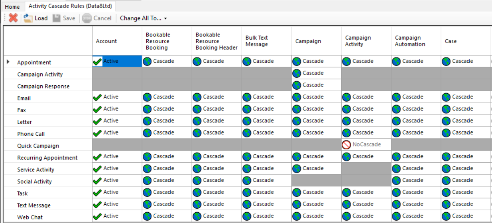

# Activity Cascade Rules XrmToolbox Plugin

This plugin simplifies the process of customizing the `Assign` cascading behavior of activity entities in Microsoft Dynamics
CRM / 365.

By default, when you reassign an account, contact, lead etc., any activities "regarding" that record are also reassigned to the
new owner. This change to the activity updates the "Modified On" field of each activity. The Activity Wall view on the
account/lead/contact form displays the Modified On field as if it was the date the activity was performed, so when all these are
updated in one go, activities from years ago can look like they were performed today, making this view useless at best and misleading
at worst.

This behavior can be modified by editing the relationship between e.g. Lead and Phone Call. Change the `Type of Behavior` from
"Parental" to "Configurable Cascading", then change the `Assign` behavior from "Cascade All" to "Cascade Active". With this option
selected, any closed activities will be left unchanged, while open activities will be reassigned as before.

The problem is there is a separate relationship to update in this way for every activity type, and for every entity type that can
have activities. So there is a relationship from Account -> Phone Call, Lead -> Phone Call, Contact -> Phone Call, Account -> Email,
Lead -> Email, Contact -> Email, .... You get the point - this can take a while!

This plugin makes it easier by showing all the possible relationships in a grid, with activity types down the side and entity types
that can have activities across the top:

The current `Assign` cascading behavior of each relationship is shown in the grid. You can change them:

* **individually** by double-clicking on a particular cell
* **for all activity types for an entity** by clicking on a column header
* **for all entity types for an activity** by clicking on a row header
* **for all activity types for all entities** by clicking `Change All To...` in the toolbar and selecting the desired behavior

Each change will cycle around the available options. Hopefully this interface will be intuitive to anyone who has changed permissions
in a security role.

Changes will be highlighted in bold. When you are happy with your changes, click `Save` in the toolbar and the plugin will make the
relevant updates to your CRM system. If you want to revert back to the current settings in CRM, click `Load`. Note there is no "Undo"
option, so be sure before you save any changes!

Some things to note:
* Clicking on a cell will show a description of the relationship at the bottom of the screen
* Some relationships are not customizable and are shown in gray
* Entities that are organisation-owned cannot have a "UserOwned" cascade type
* Not all activities can be associated with every entity type. Any relationships that don't exist are shown as dark gray blank cells